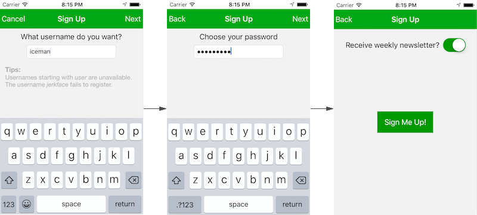

# Wizardry

A reusable way to allow users to perform a multipart task in your iOS app, written in Swift.

The demo implements a wizard that allows users to sign up to use an app.

Classes in the framework make no assumption about, nor impose restrictions upon, your wizard's visual design.

Important functionality in the wizard framework has thorough unit test coverage.
